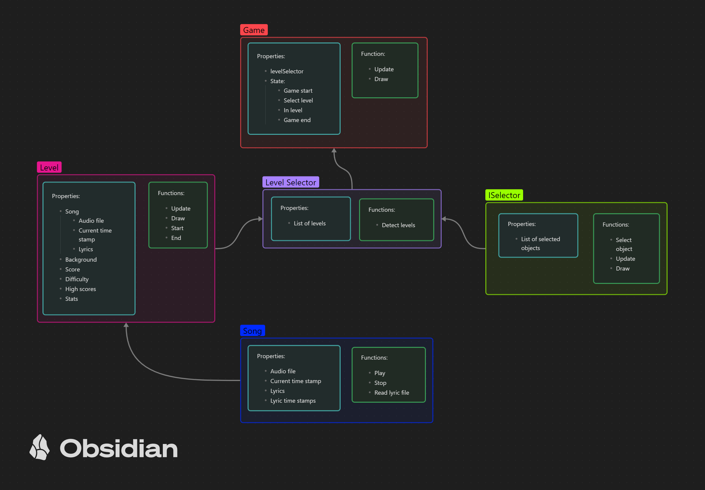

# Lyrical Typing Game

| <ins>**Table of Contents**</ins> |
| ----------------- |
| **[What is this game about?](#what-is-this-game-about)** |
| **[Installation](#installation)** |
| **[Playing the game](#playing-the-game)**  |
| **[Design](#design)** |
| **[Goals](#goals)** |
| **[Credits](#credits)** |

## What is this game about?

This game is meant to make practicing typing a little more fun.
The game is about typing along to the lyrics of a song, while the game keeps track of your speed, accuracy, and score.
You can even add your own songs to the game! **(WIP; see [issue #2](https://github.com/WhyNot180/Lyrical-Typing-Game/issues/2))**

## Installation

To install the game you must download and extract the [latest release](https://github.com/WhyNot180/Lyrical-Typing-Game/releases/tag/v0.1.0-alpha). You can then run "Lyrical Typing Game.exe"

## Playing the game

Currently, the game starts straight away upon running the program, with the song Travel Light.

Errors are displayed in the top left corner and words per minute are displayed at the top right after finishing the level.

Lyrics will be displayed as dictated by the [song's lyric file](#adding-songs), typically as they are sung. The player can type the displayed lyrics in order to earn score (currently only displayed in the [score file](#the-score-file))
and a words per minute reading. Any incorrectly typed letters will not be displayed and instead add to the player's number of errors. It is advised to be careful when typing, as spaces are not displayed and make for easy errors, and 
there new lyrics appear quickly, making for additional errors.

### The Score File

The score file is a csv file found in the game's score folder, named after its respective song.

The file contents are as follows, where each statistic is the best achieved:

	PlayerName,HighScore,WordsPerMinute,Errors

Currently, the placeholder name "bob" is used, as name creation is unimplemented (see [issue #2](https://github.com/WhyNot180/Lyrical-Typing-Game/issues/2))
In the meantime it is suggested that the name is changed manually through a text editor if data crunching of multiple players is required

### Adding Songs

This is currently being worked on and is unfinished, as such you cannot add a new song from a release version.
However, it is relatively simple to do so using the source code (note that you will have to build it in order to run it) and can be done by following these steps:

1. Creating a csv file of the lyrics
1.1 It uses the following format with no headers
```
some words, time stamp of seconds of the next lyric (e.g. 9.2)
also", a quote can be used to escape a comma, 15
, 20.5
Empty lines are also valid, 25
```
2. Placing the audio file in the Content folder (mp3, ogg)
3. Opening Content.mgcb -> clicking on "add existing item" -> selecting the audio file -> clicking save
4. The song should now be instantiated; however, level selection is still WIP, so a random level will be selected on start

## Design

The initial design breakdown of the game:



## Goals

- [x] Score
	- [x] Saveable through application
	- [ ] Readable through application
- [x] Levels
- [ ] Level selection
- [x] Song
- [x] Custom songs 
	- [ ] Using application
- [ ] User Interface
	- [ ] Start screen
	- [ ] Level end screen
	- [ ] Level screen
	- [ ] Level selection screen

## Credits

Music:
- [travelLight - airtone](https://ccmixter.org/files/airtone/56883) 
2017 - Liscenced under Creative Commons [Attribution (3.0)](https://creativecommons.org/licenses/by/3.0/)